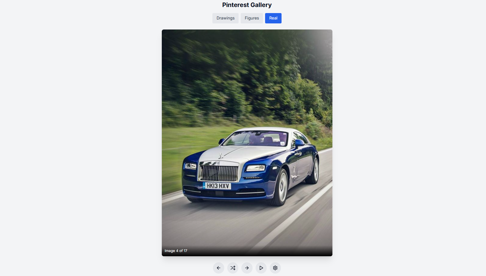

# Image Fetcher Gallery

A standalone JavaScript project that fetches images from an API and displays them in a **gallery-style viewer** with controls.

---

## ✨ Features

- Fetches images dynamically from an API
- **Next / Previous** buttons to navigate images
- **Change API** button to load images from a different source
- **Auto-slide timer** to switch images automatically
- Manual controls override auto-play
- Clean, responsive UI (Pinterest-style layout)

---

## 🧠 Concepts Used

- `fetch()` API
- `async / await`
- DOM manipulation
- Event listeners
- Timers (`setInterval`, `clearInterval`)
- State handling (current image index)

---

## 🛠️ Tech Stack

- HTML
- CSS
- JavaScript (Vanilla)

---

## ▶️ How It Works (Simple)

1. On load, an API request fetches image URLs
2. Images are stored in an array
3. Buttons update the current index
4. Timer automatically switches images after a fixed interval
5. API button re-fetches and resets the gallery

---

## 🎯 Purpose

This project is built to:

- Understand **real API usage**
- Practice async JavaScript
- Learn image navigation logic
- Handle timers and user interactions

---

## 📁 Folder Structure
